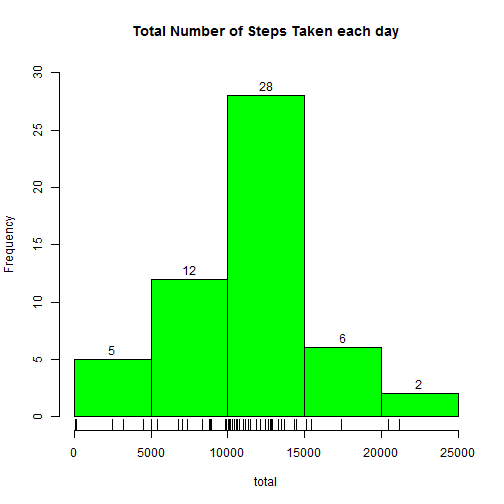
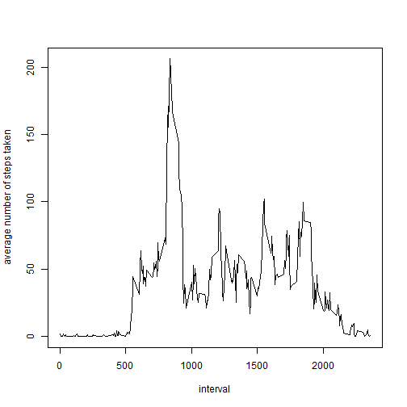
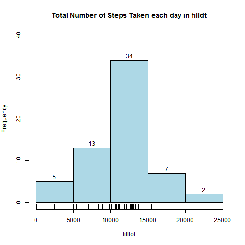
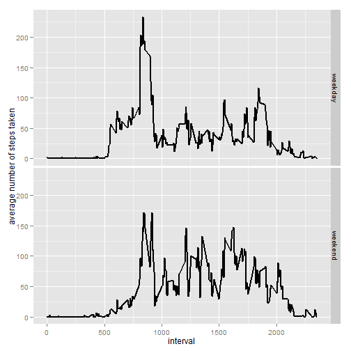

Reproducible Research: Peer Assessment 1
===========================================


## Introduction

It is now possible to collect a large amount of data about personal movement using activity monitoring devices such as a Fitbit, Nike Fuelband, or Jawbone Up. These type of devices are part of the “quantified self” movement – a group of enthusiasts who take measurements about themselves regularly to improve their health, to find patterns in their behavior, or because they are tech geeks. But these data remain under-utilized both because the raw data are hard to obtain and there is a lack of statistical methods and software for processing and interpreting the data.  

This assignment makes use of data from a personal activity monitoring device. This device collects data at 5 minute intervals through out the day. The data consists of two months of data from an anonymous individual collected during the months of October and November, 2012 and include the number of steps taken in 5 minute intervals each day.
  
## 1.Loading and preprocessing the data  
  
  
  
**Load the data**  


Need to unzip the data file "activity.csv" in the workspace first


```r
dt<- read.csv("activity.csv")
head(dt)
```

```
##   steps       date interval
## 1    NA 2012-10-01        0
## 2    NA 2012-10-01        5
## 3    NA 2012-10-01       10
## 4    NA 2012-10-01       15
## 5    NA 2012-10-01       20
## 6    NA 2012-10-01       25
```

```r
dim(dt)
```

```
## [1] 17568     3
```
  
**Process/transform the data**  

  
subset a dataframe without NA values
  

```r
good <- complete.cases(dt)
clndt<-dt[good,]
dim(clndt)
```

```
## [1] 15264     3
```

  
## 2.What is mean total number of steps taken per day?

  

**Make a histogram of the total number of steps taken each day**
  

```r
total<- tapply(clndt$steps,clndt$date,sum)
hist(total,col="green",labels= TRUE,ylim=c(0,30)
     ,main="Total Number of Steps Taken each day")
rug(total)
```

 
  
**Calculate and report the mean and median total number of steps taken per day**
  

```r
mean<- mean(total,na.rm=TRUE)
mean
```

```
## [1] 10766
```

```r
median<-quantile(total,na.rm=TRUE)[3]
median
```

```
##   50% 
## 10765
```


## 3.What is the average daily activity pattern?  
**  **  


**Make a time series plot of the 5-minute interval (x-axis) and the average number of steps taken, averaged across all days (y-axis)**  


```r
dailyavg<- tapply(clndt$steps,clndt$interval,mean)
plot(unique(clndt$interval),dailyavg,type= "n",
     xlab="interval",ylab="average number of steps taken")
lines(unique(clndt$interval),dailyavg,lty=1,lwd=1)
```

 


**Which 5-minute interval, on average across all the days in the dataset, contains the maximum number of steps? **  


```r
dailyavg[which.max(dailyavg)]
```

```
##   835 
## 206.2
```

## 4.Imputing missing values


**Calculate and report the total number of missing values in the dataset**  

  
the total number of rows with NAs:

```r
dim(dt)[1]-dim(clndt)[1]
```

```
## [1] 2304
```


**Devise a strategy for filling in all of the missing values in the dataset and create a new dataset that is equal to the original dataset but with the missing data filled in.  **  

  
  
calculate the average percentage of steps taken in each 5-minute interval 

```r
dailypct<-dailyavg/sum(dailyavg)
```
  
Using dailypct to estimate the missing data and fill them in  
If the value of total steps in certain day is NA, then using the normal distribution to estimate the value
  

```r
filldt<- dt
set.seed(29684)
for (i in 1:dim(filldt)[1]){
  if (is.na(filldt[i,1])){
    if (is.na(total[filldt[i,2]])) total[filldt[i,2]]<- round(rnorm(1,mean,sd(total,na.rm=TRUE)))
    filldt[i,1]<- round(total[filldt[i,2]]*dailypct[as.character(filldt[i,3])])
  }
}
```
  

**Make a histogram of the total number of steps taken each day and Calculate and report the mean and median total number of steps taken per day. **  

  


```r
filltot<- tapply(filldt$steps,filldt$date,sum)
hist(filltot,col="light blue",labels= TRUE,ylim=c(0,40)
     ,main="Total Number of Steps Taken each day in filldt")
rug(filltot)
```

 

```r
mean(filltot)
```

```
## [1] 11013
```

```r
quantile(filltot)[3]
```

```
##   50% 
## 11032
```


**Do these values differ from the estimates from the first part of the assignment?**

With the change of the random seed, the mean and median can increase or decrease  

For example  
When the random seed is 29684, the mean and median both increase     
However, when the random seed is 261, the mean and median both decrease 

## 5.Are there differences in activity patterns between weekdays and weekends?  
  

**Create a new factor variable in the dataset with two levels – “weekday” and “weekend” indicating whether a given date is a weekday or weekend day.**


```r
filldt$date<-as.Date(filldt$date)
wkd<- character()
for (i in 1:dim(filldt)[1]){
  wkd[i]<-if (weekdays(filldt$date[i]) %in% c("星期日","星期六")) {"weekend"} else {"weekday"}
}
filldt<-cbind(filldt,wkd)
```

**Make a panel plot containing a time series plot of the 5-minute interval (x-axis) and the average number of steps taken, averaged across all weekday days or weekend days (y-axis).** 
 

```r
wddailyavg<- with(filldt[filldt$wkd=="weekday",],tapply(steps,interval,mean))
wedailyavg<- with(filldt[filldt$wkd=="weekend",],tapply(steps,interval,mean))
p1<-cbind(dimnames(wddailyavg)[[1]],wddailyavg,rep("weekday",times=length(wddailyavg)))
p2<-cbind(dimnames(wedailyavg)[[1]],wedailyavg,rep("weekend",times=length(wedailyavg)))
p<-rbind(p1,p2)
colnames(p)<- c("interval","mean","wkd")
p<-as.data.frame(p)
p$interval <- as.numeric(as.character(p$interval))
p$mean <- as.numeric(as.character(p$mean))
head(p);str(p)
```

```
##    interval    mean     wkd
## 0         0 2.26667 weekday
## 5         5 0.40000 weekday
## 10       10 0.15556 weekday
## 15       15 0.17778 weekday
## 20       20 0.08889 weekday
## 25       25 1.64444 weekday
```

```
## 'data.frame':	576 obs. of  3 variables:
##  $ interval: num  0 5 10 15 20 25 30 35 40 45 ...
##  $ mean    : num  2.2667 0.4 0.1556 0.1778 0.0889 ...
##  $ wkd     : Factor w/ 2 levels "weekday","weekend": 1 1 1 1 1 1 1 1 1 1 ...
##   ..- attr(*, "names")= chr  "0" "5" "10" "15" ...
```

```r
library(ggplot2)
g <- ggplot(p,aes(x=interval,y=mean))
g+ geom_line(size=1, linetype = 1 ,se =FALSE) + facet_grid( wkd ~ . ) + ylab("average number of steps taken")
```

 
